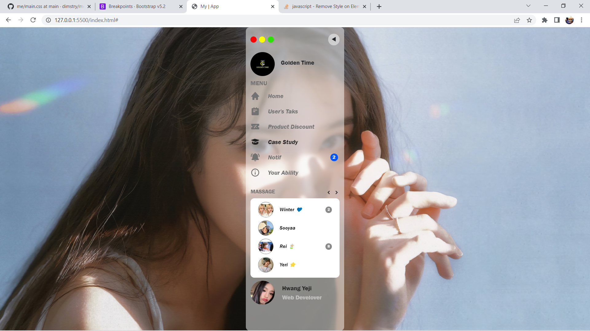

# tStsidebar
a sidebar that is made according to the design
## What use ?
* <a href="https://boxicons.com/">Box Icon</a> CDN
* <a href="https://sass-lang.com/">SASS</a> For Styling
* Framework Support <a href="https://getbootstrap.com/">BOOTSRAP</a> (ya walapun kurang kepake sih)
* HTML, CSS, JAVASCRIPT
# 💙
* Ya beda jauh sih emang tapi yaudah lah ya
* Hanya Latihan untuk SCSS
* javascript nya rada acak acak 🥲
* -Mobile view (gak mines mines amat sihh)
* Just For Fun 😂
## Result?

